# Diagrama de Classes — Gerenciador de Debate (versão 2.0)

Padrões de projeto:

| Padrão | Classes |
|--------|---------|
| **Singleton** | `FachadaDebate`, `LogSistem` |
| **Facade** | `FachadaDebate` |
| **Mediator** | `MediadorBase`, `MediarDebate` |
| **Observer** | `ObservadorEleitor`, `Eleitor`, `GerenciaEleitor` |
| **Builder** | `PoliticoBuilder`, `EleitorBuilder` |
| **Prototype** | `ColaboradorPolitico` (Cloneable), `Eleitor` (Cloneable) |

```mermaid
classDiagram
    class ConfiguraTempo {
        +TEMPO_PADRAO_SEGUNDOS: int
        -tempo_pergunta: int
        -tempo_resposta: int
        -tempo_replica: int
        -tempo_treplica: int
        +ConfiguraTempo()
        +tempos_configurados(): bool
        +resumo_tempos(): String
        +get_texto_configuracao_menu(): String
        -mesmo_tempo_em_todas_etapas(): bool
        +set_temp_pergunta(t: int)
        +get_temp_pergunta(): int
        +set_temp_resposta(t: int)
        +get_temp_resposta(): int
        +set_temp_replica(t: int)
        +get_temp_replica(): int
        +set_temp_treplica(t: int)
        +get_temp_treplica(): int
    }

    class MediadorBase {
        <<interface>>
        +debate(config: ConfiguraTempo, log: LogSistem)
    }

    class ColaboradorPolitico {
        <<Cloneable>>
        -nome: String
        -partido: String
        -inquiridor: boolean
        ~microfone: Microfone
        ~mediador: MediadorBase
        ~gerencia_eleitor: GerenciaEleitor
        ~ColaboradorPolitico()
        ~ColaboradorPolitico(nome, partido)
        +clone(): ColaboradorPolitico
        +OperacaoMediada()
        +set_nome(n: String)
        +get_nome(): String
        +set_partido(p: String)
        +get_partido(): String
        +set_mediador(mediator: MediadorBase)
        +get_mediador(): MediadorBase
        +set_inquiridor(valor: boolean)
        +get_inquiridor(): boolean
        +set_gerencia_eleitor(gerencia: GerenciaEleitor)
        +eh_mesmo(outro: ColaboradorPolitico): boolean
        ~get_microfone(): Microfone
        ~notificar_eleitores_antes_fala(etapa: String)
    }

    class Inquiridor {
        +Inquiridor(nome, partido)
        +Inquiridor(politico: ColaboradorPolitico)
        +escolha_inquirido(politico: ColaboradorPolitico)
        +perguntar(tempo: int, log: LogSistem)
        +replica(tempo: int, log: LogSistem)
        -logEscolha(politico: ColaboradorPolitico)
    }

    class Inquirido {
        +Inquirido(nome, partido)
        +Inquirido(politico: ColaboradorPolitico)
        +responder(tempo: int, log: LogSistem)
        +treplica(tempo: int, log: LogSistem)
    }

    class PoliticoBuilder {
        -nome: String
        -partido: String
        -mediador: MediadorBase
        -gerenciaEleitor: GerenciaEleitor
        -prototipo: ColaboradorPolitico
        +PoliticoBuilder()
        +PoliticoBuilder(prototipo: ColaboradorPolitico)
        +comNome(nome: String): PoliticoBuilder
        +comPartido(partido: String): PoliticoBuilder
        +comMediador(mediador: MediadorBase): PoliticoBuilder
        +comGerenciaEleitor(ge: GerenciaEleitor): PoliticoBuilder
        +build(): ColaboradorPolitico
    }

    class EleitorBuilder {
        -nome: String
        -candidatoPreferencia: ColaboradorPolitico
        -prototipo: Eleitor
        +EleitorBuilder()
        +EleitorBuilder(prototipo: Eleitor)
        +comNome(nome: String): EleitorBuilder
        +comCandidatoPreferencia(c: ColaboradorPolitico): EleitorBuilder
        +build(): Eleitor
    }

    class MediarDebate {
        -inquiridor: Inquiridor
        -inquirido: Inquirido
        +debate(config: ConfiguraTempo, log: LogSistem)
        +set_inquiridor(in: ColaboradorPolitico)
        +get_inquiridor(): Inquiridor
        +set_inquirido(inqui: ColaboradorPolitico): bool
        +get_inquirido(): Inquirido
    }

    class Microfone {
        -MicroAtivo: bool
        +Microfone()
        +liga()
        +desliga()
        +passa_tempo(tempo: int)
        +isMicroAtivo(): bool
    }

    class GerenciaPolitico {
        -politicos: List~ColaboradorPolitico~
        -quant_politicos: int
        +GerenciaPolitico()
        +criar_politico(nome, partido, mediador, gerenciaEleitor)
        +criar_politico_de_prototipo(proto, nome, partido)
        +obter_politico(nome, partido): ColaboradorPolitico
        +sortear_politico(): ColaboradorPolitico
        +get_quant_politicos(): int
        +get_politicos(): List~ColaboradorPolitico~
    }

    class ObservadorEleitor {
        <<interface>>
        +receber_notificacao(mensagem: String)
    }

    class Eleitor {
        <<Cloneable>>
        -nome: String
        -candidato_preferencia: ColaboradorPolitico
        ~Eleitor()
        ~Eleitor(nome, candidato_preferencia)
        +clone(): Eleitor
        +receber_notificacao(mensagem: String)
        +set_nome(nome: String)
        +get_nome(): String
        +set_candidato_preferencia(c: ColaboradorPolitico)
        +get_candidato_preferencia(): ColaboradorPolitico
        +acompanha(nomeCandidato, partidoCandidato): bool
    }

    class GerenciaEleitor {
        -eleitores: List~Eleitor~
        -quant_eleitores: int
        +GerenciaEleitor()
        +cadastrar_eleitor(nomeEleitor, nomeCandidato, partido, gerenciaPolitico): bool
        +cadastrar_eleitor_de_prototipo(proto, nome, cand, partido, gp): bool
        +notificar_inicio_fala(nomeCandidato, partidoCandidato, etapa)
        +get_quant_eleitores(): int
        +get_eleitores(): List~Eleitor~
    }

    class LogSistem {
        -instance: LogSistem
        -file_path: String
        -LogSistem(file_path: String)
        +get_instance(file: String): LogSistem
        +get_file_path(): String
        +register_log(msg: String)
        +get_logs_register(): String
    }

    class FachadaDebate {
        -instance: FachadaDebate
        -config: ConfiguraTempo
        -mediador: MediadorBase
        -gerenciador: GerenciaPolitico
        -gerencia_eleitor: GerenciaEleitor
        -log: LogSistem
        -FachadaDebate()
        +get_instance(): FachadaDebate
        +configuracao(pergunta, resposta, replica, treplica: int)
        +cadastrar_politicos(nome, partido, mediador)
        +cadastrar_politico_de_prototipo(nProt, pProt, nNovo, pNovo)
        +cadastrar_eleitor(nomeEleitor, nomeCandidato, partidoCandidato)
        +cadastrar_eleitor_de_prototipo(nProt, nNovo, nCand, pCand)
        +sorteio_inquiridor()
        +escolher_inquirido(nome, partido)
        +executa_debate(config, log)
        +acessar_log()
        +get_config(): ConfiguraTempo
        +get_mediador(): MediadorBase
        +get_gerenciador(): GerenciaPolitico
        +get_log(): LogSistem
        +get_gerencia_eleitor(): GerenciaEleitor
    }

    class GUI {
        -f: FachadaDebate
        +GUI()
        +RealizarOperacao()
    }

    class CLI {
        -f: FachadaDebate
        -scanner: Scanner
        +CLI()
        +RealizarOperacao()
        +main(args: String[])
        -exibirCabecalho()
        -exibirMenu()
        -configurarTempos()
        -cadastrarPolitico()
        -cadastrarEleitor()
        -escolherInquirido()
        -lerInteiroComPadrao(rotulo, valorAtual): int
    }

    ColaboradorPolitico <|-- Inquiridor
    ColaboradorPolitico <|-- Inquirido
    MediadorBase <|.. MediarDebate
    ObservadorEleitor <|.. Eleitor

    FachadaDebate --> ConfiguraTempo
    FachadaDebate --> MediadorBase
    FachadaDebate --> GerenciaPolitico
    FachadaDebate --> GerenciaEleitor
    FachadaDebate --> LogSistem

    MediarDebate --> Inquiridor
    MediarDebate --> Inquirido
    MediarDebate ..> ConfiguraTempo : usa tempos
    MediarDebate --> LogSistem

    Inquiridor --> LogSistem
    Inquirido --> LogSistem
    Inquiridor ..> ConfiguraTempo : tempo da fala
    Inquirido ..> ConfiguraTempo : tempo da fala

    ColaboradorPolitico --> Microfone
    ColaboradorPolitico --> MediadorBase
    ColaboradorPolitico ..> GerenciaEleitor : notifica antes da fala

    PoliticoBuilder ..> ColaboradorPolitico : constrói / clona
    EleitorBuilder ..> Eleitor : constrói / clona

    GerenciaPolitico "1" --> "1..*" ColaboradorPolitico
    GerenciaPolitico ..> PoliticoBuilder : usa Builder
    GerenciaEleitor "1" --> "0..*" Eleitor
    GerenciaEleitor ..> EleitorBuilder : usa Builder
    GerenciaEleitor ..> GerenciaPolitico : busca candidato no cadastro
    Eleitor "1" --> "1" ColaboradorPolitico : candidato de preferência

    GUI --> FachadaDebate
    CLI --> FachadaDebate
    CLI ..> ConfiguraTempo : exibe tempos no menu
```



> **Visibilidade no diagrama:** `-` = private, `~` = protected (como em `ColaboradorPolitico` no Java).

## Padrões Builder e Prototype

### Builder
Os builders (`PoliticoBuilder` e `EleitorBuilder`) encapsulam a construção passo a passo dos objetos `ColaboradorPolitico` e `Eleitor`. Em vez de instanciar diretamente com `new`, usa-se a **fluent API**:

```java
// Builder — construção do zero
ColaboradorPolitico p = new PoliticoBuilder()
    .comNome("Lula")
    .comPartido("PT")
    .comMediador(mediador)
    .comGerenciaEleitor(ge)
    .build();

Eleitor e = new EleitorBuilder()
    .comNome("João")
    .comCandidatoPreferencia(candidato)
    .build();
```

### Prototype
`ColaboradorPolitico` e `Eleitor` implementam `Cloneable` e expõem o método `clone()`. Os builders aceitam um protótipo no construtor, combinando ambos os padrões:

```java
// Prototype + Builder — clonar e customizar
ColaboradorPolitico clone = new PoliticoBuilder(prototipoExistente)
    .comNome("Bolsonaro")
    .comPartido("PL")
    .build(); // clona o protótipo e altera nome/partido
```

### Onde cada padrão é usado

| Local | Padrão |
|-------|--------|
| `GerenciaPolitico.criar_politico()` | **Builder** (PoliticoBuilder) |
| `GerenciaPolitico.criar_politico_de_prototipo()` | **Prototype + Builder** |
| `GerenciaEleitor.cadastrar_eleitor()` | **Builder** (EleitorBuilder) |
| `GerenciaEleitor.cadastrar_eleitor_de_prototipo()` | **Prototype + Builder** |
| `ColaboradorPolitico.clone()` | **Prototype** |
| `Eleitor.clone()` | **Prototype** |
| `FachadaDebate.cadastrar_politico_de_prototipo()` | **Prototype + Builder** (via Facade) |
| `FachadaDebate.cadastrar_eleitor_de_prototipo()` | **Prototype + Builder** (via Facade) |

## Fluxo principal do debate

1. `FachadaDebate.get_instance()` — obtém a instância única.
2. `configuracao(...)` — define os tempos de cada etapa (padrão **15 s**; exibidos no menu como *configurado para Xs por etapa*).
3. `cadastrar_politicos(...)` — cadastra os políticos (via **Builder**).
4. `cadastrar_politico_de_prototipo(...)` — cadastra político clonando um existente (**Prototype + Builder**).
5. `cadastrar_eleitor(...)` — eleitor escolhe **um único** candidato para notificações (via **Builder**).
6. `cadastrar_eleitor_de_prototipo(...)` — cadastra eleitor clonando um existente (**Prototype + Builder**).
7. `sorteio_inquiridor()` — sorteia quem pergunta.
8. `escolher_inquirido(...)` — define quem responde (**não pode ser a mesma pessoa** que o inquiridor).
9. `executa_debate(...)` — valida tempos e papéis; executa:
   - notificação aos eleitores → microfone ligado → contagem regressiva → microfone desligado;
   - sequência: **pergunta → resposta → réplica → tréplica**.
10. `acessar_log()` — consulta o histórico em `debate.log`.

## Fluxo de notificação (Observer)

1. Eleitor se cadastra via `FachadaDebate.cadastrar_eleitor`.
2. `GerenciaEleitor` mantém a lista de eleitores por candidato de preferência.
3. Antes de cada fala, `notificar_eleitores_antes_fala` dispara `notificar_inicio_fala`.
4. Eleitores do candidato recebem: **"SEU CANDIDATO ESTÁ FALANDO — Candidato X (partido) está falando (etapa)"**.
5. Em seguida o microfone é ligado e `passa_tempo` aguarda os segundos configurados.

## Regras de negócio implementadas

| Regra | Onde |
|-------|------|
| Inquiridor ≠ inquirido | `MediarDebate.set_inquirido`, `debate`, `FachadaDebate.escolher_inquirido` |
| Tempos > 0 para debate | `ConfiguraTempo.tempos_configurados`, `FachadaDebate.executa_debate` |
| Padrão 15 s por etapa | `ConfiguraTempo.TEMPO_PADRAO_SEGUNDOS` |
| Um candidato por eleitor | `Eleitor.candidato_preferencia` |
| Contagem real de tempo | `Microfone.passa_tempo` (`Thread.sleep` 1 s por segundo) |
